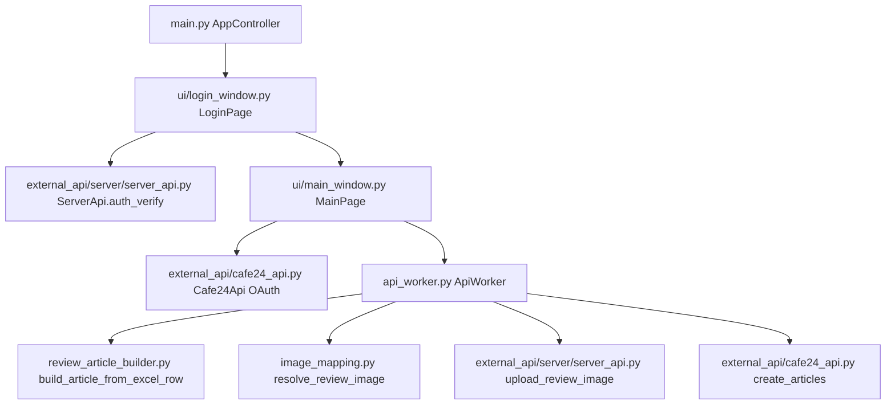

# Review Writer Knowledge Index

이 문서는 coding agent가 전체 파일을 매번 훑지 않고도 프로젝트 구조와 변경 지점을 빠르게 파악하기 위한 지식 그래프입니다. 작업을 시작할 때 먼저 이 파일을 읽고, 필요한 모듈만 추가로 확인하세요.

## 유지 규칙

- 코드 파일을 추가, 수정, 삭제했다면 이 문서의 관련 항목도 함께 업데이트합니다.
- 책임 경계가 바뀌면 `Module Map`, `Core Flow`, `Change Guide`를 갱신합니다.
- 새 요구사항이 특정 파일에 영향을 준다면 `Feature Notes`에 의사결정과 후속 작업을 남깁니다.
- UI 문구, 엑셀 컬럼명, 외부 API payload 필드처럼 사용자/서버 계약이 되는 값은 이 문서에서 추적합니다.
- 배포 가능한 코드 변경은 `version.py` 버전 bump와 `docs/release-process.md` 규칙을 확인합니다.

## Product Summary

Review Writer는 Cafe24 쇼핑몰 운영자가 엑셀 파일로 작성한 리뷰 데이터를 Cafe24 게시판 API에 일괄 등록하는 PyQt6 데스크톱 앱입니다. 앱 시작 시 서버 인증으로 허용된 기기인지 확인하고, Cafe24 OAuth 인증 후 리뷰 데이터를 배치로 전송합니다.

## Core Flow



## Module Map

| Path | Role | Notes |
| --- | --- | --- |
| `README.md` | 프로젝트 소개 및 사용/운영 진입점 | local runner 테스트 문장과 운영/배포 흐름 문서 링크를 포함합니다. |
| `main.py` | 앱 진입점 및 페이지 전환 컨트롤러 | `LoginPage` 인증 성공 결과를 `MainPage.set_auth_info()`로 전달합니다. |
| `ui/login_window.py` | 기기 인증 UI | `ServerApi.auth_verify()`를 호출해 UUID 인증 결과를 확인합니다. |
| `ui/main_window.py` | 메인 작업 UI | 게시판 번호, 상품 번호, 엑셀 파일 선택, Cafe24 인증, 리뷰 등록 시작을 담당합니다. 비즈니스 변환 로직을 넣지 않습니다. |
| `api_worker.py` | 리뷰 등록 백그라운드 작업 orchestration | 엑셀 읽기, progress/log signal, 배치 전송을 담당합니다. 행 변환은 `review_article_builder.py`에 위임합니다. |
| `review_article_builder.py` | 엑셀 행 -> Cafe24 article payload 변환 | 엑셀 컬럼명, 기본 작성자, 제목 fallback, `image_url` 매핑을 관리합니다. |
| `image_mapping.py` | 리뷰 이미지 출처 결정 | 엑셀 URL, 이미지 파일명, 선택된 이미지 폴더를 기준으로 기존 URL 사용 또는 업로드 대상을 결정합니다. |
| `review_preflight.py` | 등록 전 사전 검사 | 전체 행, 등록 가능 행, URL 이미지, 업로드 필요 이미지, 경고 수를 계산합니다. |
| `auto_updater.py` | 앱 자동 업데이트 | Pages `latest.json`을 확인해 새 버전이 있으면 다운로드, SHA256 검증, OS별 교체/재실행을 수행합니다. |
| `docs/user-guide.md` | 사용자용 사용 가이드 | 엑셀 작성법, 이미지 매칭 방식, 앱 사용 순서, 오류 대응을 설명합니다. |
| `docs/Review Writer 스크린샷 사용자 가이드.pdf` | 고객 전달용 시각 가이드 | 실제 앱 화면 캡처를 중심으로 사용 흐름을 설명하는 PDF입니다. |
| `docs/assets/guide-*.png` | 가이드용 앱 화면 캡처 | PDF 사용자 가이드에 삽입되는 실제 화면 이미지입니다. |
| `docs/release-process.md` | 버전/PR/배포 운영 규칙 | 버그 수정, 기능 추가, 버전 bump, Slack/GitHub 승인, Release/Pages 업데이트 정책을 정의합니다. |
| `docs/slack-operations.md` | Slack 운영 템플릿 | 버그/기능 요청, PR 알림, 배포 요청 메시지 형식을 정의합니다. |
| `docs/slack-release-webhook.md` | Slack 작업/배포 명령 연동 문서 | `/review-task` Codex 작업 대기 Issue 생성, `/review-release 배포해` workflow 실행 설정을 설명합니다. |
| `docs/local-codex-runner.md` | 로컬 Codex runner 운영 설계 | PC가 켜져 있을 때 GitHub Issue를 감지해 Codex CLI로 작업/PR을 자동화하는 구조와 테스트 절차를 설명합니다. |
| `scripts/slack_release_worker.mjs` | Cloudflare Worker Slack webhook | `/review-task`는 GitHub Issue를 생성하고, `/review-release`는 GitHub workflow dispatch API로 `release.yml`을 실행합니다. |
| `scripts/local_codex_runner.py` | 로컬 Codex runner | `codex-task` Issue를 감지해 branch 생성, `codex exec`, 테스트, commit/push, PR 생성을 자동화합니다. |
| `scripts/slack_release_lambda.py` | Slack Slash Command Lambda 예시 | Slack signature를 검증하고 GitHub workflow dispatch API로 `release.yml`을 실행합니다. |
| `.github/codex-instructions.md` | Codex coding agent 지침 | 작업 전 `Index.md`와 release process를 읽고 PR 본문/버전 bump 규칙을 따르도록 안내합니다. |
| `.github/ISSUE_TEMPLATE/*.md` | GitHub Issue 템플릿 | 버그 리포트와 기능 요청에 필요한 정보를 표준화합니다. |
| `.github/pull_request_template.md` | GitHub PR 템플릿 | 변경 유형, 버전 bump, 테스트, 릴리즈 노트, 리스크를 PR마다 확인합니다. |
| `.github/workflows/release.yml` | draft release 생성 workflow | `workflow_dispatch`로 실행되며 빌드 산출물과 `latest.json`을 담은 draft GitHub Release를 생성합니다. |
| `.github/workflows/pages-on-release.yml` | Pages 배포 workflow | draft release가 publish되면 Pages `latest.json`과 다운로드 페이지를 갱신합니다. |
| `img.png` | README 배포 흐름 이미지 | Slack 요청부터 PR, 테스트 승인, release workflow, draft release 승인, 사용자 업데이트까지의 운영 흐름을 시각화합니다. |
| `external_api/cafe24_api.py` | Cafe24 OAuth 및 Admin API client | 브라우저 인증, token 발급, 게시글 생성 요청을 담당합니다. |
| `external_api/server/server_api.py` | 자체 서버 API client | `.env` 기반 서버 URL/CA 인증서를 로드하고 기기 인증 API와 리뷰 이미지 업로드 API를 호출합니다. |
| `external_api/server/models.py` | 자체 서버 응답 모델 | 인증 성공/실패, 이미지 업로드 응답을 dataclass로 파싱합니다. |
| `auth_worker.py` | Cafe24 OAuth QThread | 브라우저 인증 과정을 UI thread 밖에서 실행합니다. |
| `logger/file_logger.py` | 전역 logger | 콘솔과 `logs/app.log`에 rotating log를 남깁니다. |
| `utils/computer_resource.py` | 장치 UUID 조회 | Windows/macOS UUID 추출을 담당합니다. |
| `utils/validator.py` | UUID 형식 검증 | 현재 수동 인증 UI가 비활성화되어 있어 사용 빈도는 낮습니다. |
| `internal_api/internal_api.py` | 과거/placeholder 내부 API | 현재 주요 인증 흐름에서는 `ServerApi`를 사용합니다. 정리 후보입니다. |
| `global_constants.py` | debug/sample/build 상수 | sample 만료 정책이 `MainPage.check_license()`와 연결됩니다. |
| `version.py` | 앱 버전 | 로그인 화면 로그에 사용됩니다. |

## Data Contracts

### Excel Input Columns

| Column | Required | Target Field | Behavior |
| --- | --- | --- | --- |
| `제목` | No | `title` | 비어 있으면 `리뷰내용` 앞 20자를 제목으로 사용합니다. |
| `작성자` | No | `writer` | 비어 있으면 `이재용`을 사용합니다. |
| `리뷰내용` | Conditional | `content` | 제목도 본문도 비어 있으면 해당 행을 건너뜁니다. |
| `별점` | No | `rating` | 값이 있으면 정수 변환 후 전송합니다. |
| `날짜` | No | `created_date` | 값이 있으면 그대로 전송합니다. |
| `하이퍼링크` | No | `attach_file_urls[].url` | 공개 이미지 URL입니다. 기본 이미지 매칭 방식에서는 이 값이 있으면 우선 사용하고, Cafe24 게시글 첨부 파일 URL로 전송합니다. |
| `이미지파일명` | No | upload source | 선택한 이미지 폴더 안의 파일명입니다. `하이퍼링크`가 없으면 서버에 업로드해 URL을 생성합니다. |

### Cafe24 Article Payload

`review_article_builder.py`가 생성하는 기본 payload:

```python
{
    "product_no": product_no,
    "writer": writer_name,
    "title": title,
    "content": content,
    "client_ip": "127.0.0.1",
}
```

선택 필드: `rating`, `created_date`, `attach_file_urls`.

## Change Guide

- 엑셀 컬럼 추가/변경: `review_article_builder.py`를 먼저 수정하고 이 문서의 `Data Contracts`를 갱신합니다.
- 이미지 매칭 정책 변경: `image_mapping.py`, `review_preflight.py`, `ui/main_window.py`를 함께 확인합니다.
- Cafe24 게시글 payload 변경: `review_article_builder.py`와 `external_api/cafe24_api.py`의 API 호출 규격을 함께 확인합니다.
- UI 입력/버튼/작업 단계 변경: `ui/main_window.py`에서 사용자 흐름을 수정하고, 비즈니스 로직은 별도 모듈에 둡니다.
- 인증/라이선스 정책 변경: `ui/login_window.py`, `external_api/server/server_api.py`, `external_api/server/models.py`를 확인합니다.
- 장시간 작업/네트워크 작업 변경: UI freeze 방지를 위해 `QThread` worker에 유지합니다.

## Release Flow

- 버그 수정과 기능 구현은 같은 PR -> 테스트 -> merge -> Slack 배포 요청 -> draft release 생성 -> GitHub Release publish 승인 흐름을 따릅니다.
- 버그 수정은 PATCH, 기능 추가는 MINOR, 호환성 깨지는 변경은 MAJOR를 올립니다.
- Windows와 macOS는 항상 같은 버전을 배포합니다.
- 배포 버전의 단일 기준은 `version.py`입니다.
- PR 본문에는 변경 유형, version bump, 현재/다음 버전, 테스트, 릴리즈 노트, 리스크를 적습니다.
- Slack의 "배포해"는 GitHub Actions release workflow 실행 요청이며, 실제 공개 전 GitHub draft release 화면에서 `Publish release`를 한 번 더 수행합니다.
- 실행 파일은 GitHub Releases에 올리고, GitHub Pages는 다운로드 페이지와 `latest.json` 같은 최신 버전 metadata를 제공합니다.
- 앱 실행 시 `auto_updater.py`가 `UPDATE_LATEST_URL` 또는 기본 Pages URL의 `latest.json`을 확인하고, 새 버전이 있으면 사용자 승인 후 OS별 업데이트를 적용합니다.
- 상세 운영 규칙은 `docs/release-process.md`를 따릅니다.

## Refactoring Notes

- 2026-04-24: `ApiWorker.run()`에서 엑셀 행 변환 책임을 `review_article_builder.py`로 분리했습니다. 이후 이미지 업로드 요구사항은 이 builder 앞단 또는 별도 image service를 통해 URL을 보강하는 방식으로 확장하는 것이 자연스럽습니다.
- 2026-04-24: 서버가 `/review-images` API를 제공한다는 전제로 이미지 폴더 선택, `이미지파일명` 매칭, 사전 검사, multipart 업로드 client를 미리 구현했습니다.
- 2026-04-24: `IS_DEBUG=True`일 때 서버 인증을 우회하더라도 `VerifyConfirm` 형태의 디버그 인증 정보를 만들어 `MainPage`에 전달하도록 수정했습니다.
- 추가 정리 후보: `internal_api/internal_api.py`는 현재 주요 흐름에서 쓰이지 않는 placeholder입니다. 실제 사용처가 없으면 제거하거나 legacy로 명시하는 것이 좋습니다.

## Feature Notes

### 사용자 이미지 업로드 -> 자동 URL 생성

현재 앱은 엑셀 `하이퍼링크` URL과 로컬 이미지 폴더 + `이미지파일명` 컬럼을 모두 지원합니다. 로컬 이미지가 필요한 행은 서버 `/review-images`에 업로드하고, 반환된 URL을 Cafe24 `attach_file_urls`로 보냅니다.

권장 방향:

- 서버가 이미지 저장소를 관리하고, 데스크톱 앱은 이미지 파일을 서버에 업로드한 뒤 URL만 받습니다.
- 이유: Cafe24에 전달할 URL은 공개 접근 가능해야 하며, 로컬 PC 경로나 임시 파일은 Cafe24 서버에서 접근할 수 없습니다. URL 생성, 파일명 충돌 방지, 인증, 만료 정책, 삭제 정책은 서버가 담당하는 편이 안전합니다.
- 앱 UI는 엑셀 URL 입력만 강제하지 않고, 이미지 폴더를 선택해 행별 이미지와 매칭할 수 있습니다.

필요 환경 변수:

- `API_BASE_URL`: 자체 서버 base URL
- `API_TIMEOUT_SEC`: 일반 JSON API timeout, 기본 10초
- `API_UPLOAD_TIMEOUT_SEC`: 이미지 업로드 timeout, 기본 60초
- `API_CA_CERT_PATH`: 서버 TLS CA 인증서 경로
- `UPDATE_LATEST_URL`: 자동 업데이트 metadata URL. 기본값은 `https://ssmakers.github.io/reviewMaker/latest.json`입니다.

디버그 모드에서 Cafe24 인증/업로드까지 테스트할 때 필요한 환경 변수:

- `CAFE24_CLIENT_ID`: Cafe24 앱 client id
- `CAFE24_CLIENT_SECRET`: Cafe24 앱 secret
- `CAFE24_MALL_ID` 또는 `DEBUG_MALL_ID`: Cafe24 mall id
- `CAFE24_REDIRECT_URL`: 선택 사항. 없으면 `https://{mall_id}.cafe24.com/order/basket.html`을 사용합니다.
