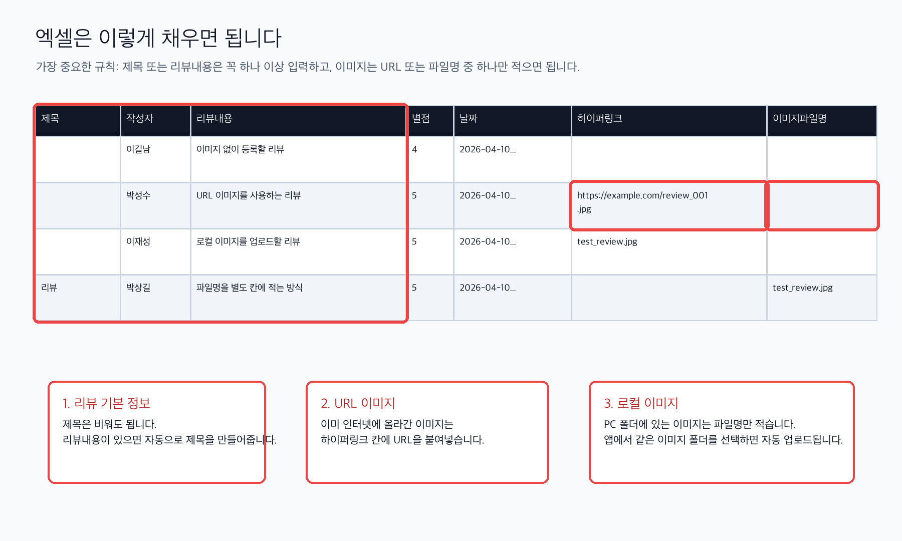
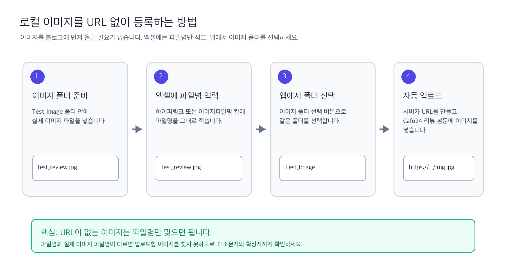

# Review Writer 사용자 가이드

처음 사용하는 경우 아래 순서만 먼저 확인하면 됩니다.

1. [샘플 엑셀 파일](assets/review-writer-sample.xlsx)을 열어 같은 형식으로 리뷰를 작성합니다.
2. 이미지가 인터넷에 이미 올라가 있으면 `하이퍼링크` 칸에 URL을 붙여넣습니다.
3. PC에 있는 이미지를 쓰려면 `하이퍼링크` 또는 `이미지파일명` 칸에 파일명만 입력하고, 앱에서 같은 이미지 폴더를 선택합니다.
4. 앱에서 엑셀 파일, 이미지 폴더, 게시판 번호, 상품 번호를 선택한 뒤 `리뷰 등록 시작`을 누릅니다.

고객에게 전달할 때는 [사용자 가이드 PDF](Review%20Writer%20사용자%20가이드.pdf)와 [샘플 엑셀 파일](assets/review-writer-sample.xlsx)을 함께 보내면 됩니다. 도입 효과를 설명해야 하는 경우 [상품 설명서 PDF](Review%20Writer%20상품%20설명서.pdf)를 함께 전달하세요.





## 1. 준비물

Review Writer를 사용하기 전에 아래 항목을 준비합니다.

- Cafe24 관리자 계정
- 리뷰를 등록할 Cafe24 게시판 번호
- 리뷰를 연결할 상품 번호
- 리뷰 데이터가 들어있는 엑셀 파일
- 이미지가 있는 경우, 공개 이미지 URL 또는 이미지 파일 폴더

## 2. 엑셀 파일 작성 방법

엑셀 첫 번째 행에는 아래 컬럼명을 넣습니다. 모든 컬럼이 필수는 아니지만, `제목` 또는 `리뷰내용` 중 하나는 반드시 있어야 합니다. 새 파일을 만들기 어렵다면 [샘플 엑셀 파일](assets/review-writer-sample.xlsx)을 복사해 사용하세요.

| 컬럼명 | 필수 여부 | 설명 |
| --- | --- | --- |
| `제목` | 선택 | 리뷰 제목입니다. 비어 있으면 `리뷰내용` 앞부분으로 자동 생성됩니다. |
| `작성자` | 선택 | 리뷰 작성자명입니다. 비어 있으면 기본 작성자명이 사용됩니다. |
| `리뷰내용` | 조건부 필수 | 리뷰 본문입니다. `제목`도 `리뷰내용`도 비어 있으면 해당 행은 등록되지 않습니다. |
| `별점` | 선택 | 리뷰 별점입니다. 값이 있으면 정수로 전송됩니다. |
| `날짜` | 선택 | 리뷰 작성일입니다. |
| `하이퍼링크` | 선택 | 이미 공개 URL이 있는 이미지 주소입니다. 기존 양식 호환을 위해 파일명만 입력해도 선택한 이미지 폴더에서 파일을 찾습니다. |
| `이미지파일명` | 선택 | 이미지 폴더 안에 있는 파일명입니다. 새 양식을 만든다면 로컬 이미지 파일명은 이 컬럼에 적는 것을 권장합니다. 예: `review_001.jpg` |

## 3. 이미지 사용 방식

Review Writer는 세 가지 이미지 매칭 방식을 제공합니다.

| 방식 | 설명 | 추천 상황 |
| --- | --- | --- |
| URL 우선, 없으면 파일명 | `하이퍼링크` 값이 URL이면 그대로 사용하고, 파일명이면 이미지 폴더에서 파일을 찾습니다. `이미지파일명` 컬럼도 사용할 수 있습니다. | 기본 추천 방식 |
| 엑셀 URL만 사용 | `하이퍼링크` 컬럼만 사용합니다. 로컬 이미지 파일은 업로드하지 않습니다. | 기존 방식 그대로 사용할 때 |
| 파일명으로 매칭 | `이미지파일명` 컬럼과 선택한 이미지 폴더만 사용합니다. | URL 없이 로컬 이미지로만 작업할 때 |

이미지 파일명 매칭을 사용할 때는 엑셀의 파일명 값과 실제 파일명이 정확히 같아야 합니다. 새 엑셀을 만든다면 `이미지파일명` 컬럼을 쓰는 것이 가장 명확합니다. 이미 `하이퍼링크` 컬럼에 파일명을 넣어둔 엑셀도 기본 방식에서는 그대로 사용할 수 있습니다.

로컬 이미지 예시:

- 이미지 폴더: `Test_Image`
- 실제 파일: `test_review.jpg`
- 엑셀 입력값: `test_review.jpg`
- 앱에서 선택할 폴더: `Test_Image`

예:

| 제목 | 작성자 | 리뷰내용 | 별점 | 하이퍼링크 | 이미지파일명 |
| --- | --- | --- | --- | --- | --- |
| 좋아요 | 김민수 | 배송이 빠르고 품질도 좋습니다. | 5 |  | review_001.jpg |
| 만족합니다 | 이서연 | 사진과 같아요. | 5 | https://example.com/review_002.jpg |  |
| 편해요 | 박지훈 | 다시 구매할 것 같아요. | 5 | review_003.jpg |  |

## 4. 프로그램 사용 순서

1. 프로그램을 실행합니다.
2. 기기 인증이 완료되면 `프로그램 시작하기` 버튼을 누릅니다.
3. 메인 화면에서 `게시판 번호`를 입력합니다.
4. `상품 번호`를 입력합니다.
5. `엑셀 파일 선택` 버튼을 눌러 리뷰 엑셀 파일을 선택합니다.
6. 이미지 파일을 사용할 경우 `이미지 폴더 선택` 버튼을 눌러 이미지 폴더를 선택합니다.
7. `이미지 매칭 방식`을 선택합니다. 기본값은 `URL 우선, 없으면 파일명`입니다.
8. `인증` 버튼을 누르고 Cafe24 관리자 계정으로 로그인한 뒤 권한을 허용합니다.
9. Access Token 발급 완료 로그를 확인합니다.
10. `리뷰 등록 시작` 버튼을 누릅니다.
11. 작업 로그와 진행률을 확인합니다.

## 5. macOS에서 처음 실행하는 방법

Apple Developer 공증을 적용하기 전까지 macOS에서는 처음 실행할 때 보안 안내가 표시될 수 있습니다. 이 안내는 앱이 반드시 악성이라는 뜻이 아니라, Apple이 개발자 서명과 공증을 확인할 수 없다는 의미입니다.

처음 1회는 아래 순서로 실행합니다.

1. macOS용 zip 파일을 다운로드합니다.
2. zip 파일 압축을 풉니다.
3. `Review_Program_버전.app` 아이콘을 더블클릭하지 말고 우클릭합니다.
4. 메뉴에서 `열기`를 클릭합니다.
5. 보안 안내창이 뜨면 다시 `열기`를 클릭합니다.

`열기` 버튼이 보이지 않는 경우:

1. `시스템 설정`을 엽니다.
2. `개인정보 보호 및 보안`으로 이동합니다.
3. 아래쪽 `보안` 영역에서 Review Writer 실행이 차단되었다는 안내를 찾습니다.
4. `확인 없이 열기`를 클릭합니다.
5. 다시 앱을 실행합니다.

그래도 열리지 않으면 관리자에게 아래 정보를 함께 전달합니다.

- 사용 중인 macOS 버전
- 다운로드한 파일명
- 화면에 표시된 경고 문구
- 앱 실행 시각
- 로그 파일: `~/Library/Logs/Review Writer/app.log`

관리자가 요청한 경우에만 터미널에서 아래 명령을 실행합니다. 일반 사용자는 우클릭 후 `열기` 방식을 먼저 사용하세요.

```bash
xattr -dr com.apple.quarantine "$HOME/Downloads/Review_Program_1.1.1.app"
```

## 6. 작업 로그에서 확인할 내용

등록을 시작하면 먼저 사전 검사 결과가 표시됩니다.

- 전체 행: 엑셀에서 읽은 전체 리뷰 수
- 등록 가능: 제목 또는 본문이 있어 등록 가능한 행 수
- 건너뜀: 제목과 본문이 모두 없어 제외된 행 수
- URL 이미지: `하이퍼링크` URL을 그대로 사용하는 이미지 수
- 업로드 필요 이미지: 서버에 업로드해 URL을 생성해야 하는 이미지 수
- 이미지 없음: 이미지 없이 등록되는 리뷰 수
- 이미지 경고: 파일명을 찾을 수 없거나 이미지 설정이 맞지 않는 행 수

이미지 업로드가 필요한 행은 서버에 이미지가 먼저 업로드되고, 서버가 반환한 URL이 Cafe24 리뷰 등록 요청에 포함됩니다.

오류가 발생하면 작업 로그 하단에 로그 파일 경로가 함께 표시됩니다. 해당 경로의 `app.log`를 관리자에게 전달하면 원인 분석이 빨라집니다.

## 7. 자주 발생하는 문제

### 엑셀 파일을 선택하라는 오류가 나옵니다

`리뷰 등록 시작` 전에 `엑셀 파일 선택`을 먼저 눌러 파일을 선택해야 합니다.

### 먼저 인증을 완료하라는 오류가 나옵니다

Cafe24 리뷰 등록 전에는 `인증` 버튼을 눌러 Cafe24 Access Token을 발급받아야 합니다.

### 등록되지 않은 기기라고 나옵니다

로그인 화면 하단 `등록 요청` 버튼을 눌러 관리자 승인 요청을 보낼 수 있습니다.  
하나의 입력창에서 `Mall ID`, `Redirect URL`, `Client ID`, `Client Secret`을 모두 입력한 뒤 `전송`을 누릅니다.  
항목이 하나라도 비어 있으면 전송되지 않습니다.
요청 접수 후 관리자가 승인하면 앱을 다시 실행해 인증을 확인합니다.

### 이미지 파일을 찾을 수 없다는 경고가 나옵니다

아래를 확인합니다.

- `이미지 폴더 선택`이 되어 있는지
- 엑셀의 `이미지파일명` 값과 실제 파일명이 같은지
- 파일 확장자가 `.jpg`, `.jpeg`, `.png`, `.webp`인지

### 디버그 모드에서 mall id 오류가 나옵니다

디버그 모드에서 Cafe24 인증까지 테스트하려면 `.env`에 `CAFE24_MALL_ID` 또는 `DEBUG_MALL_ID`를 설정해야 합니다.

### 로그 파일은 어디에 있나요?

문제가 발생했을 때 관리자에게 아래 로그 파일을 전달합니다.

- macOS: `~/Library/Logs/Review Writer/app.log`
- Windows: `%LOCALAPPDATA%\Review Writer\Logs\app.log`

## 8. 서버 이미지 업로드 기능 사용 조건

로컬 이미지를 자동 URL로 바꾸려면 서버가 `POST /review/image/upload` API를 제공해야 합니다. 서버가 준비되지 않은 상태에서는 `하이퍼링크` 컬럼에 이미 공개된 이미지 URL을 넣는 기존 방식으로 사용할 수 있습니다.

## 9. PC UUID 확인 방법

기기 등록 또는 인증 확인이 필요할 때는 아래 UUID 값을 관리자에게 전달합니다.

### macOS

터미널 앱을 열고 아래 명령어를 실행합니다.

```bash
ioreg -rd1 -c IOPlatformExpertDevice | awk -F\" '/IOPlatformUUID/{print $(NF-1)}'
```

### Windows

PowerShell을 열고 아래 명령어를 실행합니다.

```powershell
Get-CimInstance Win32_ComputerSystemProduct | Select-Object -ExpandProperty UUID
```

CMD를 쓰는 경우 아래 명령어도 사용할 수 있습니다.

```cmd
wmic csproduct get uuid
```

하이픈이 포함된 UUID 전체를 복사해 전달하세요.
